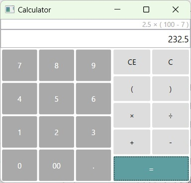

# Calculator

A simple calculator application for learning programming.

#### Sample image (C# - WPF)

## Programming Languages

### C# - WPF
[CSharp/SimpleCalculator.Wpf](CSharp/SimpleCalculator.Wpf)

| Environment | Version |
| ---- | ---- |
| Framework | .NET8 |
| Visual studio 2022 | 17.8.3 |

<!-- ### Python

| Environment | Version |
| ---- | ---- |
| Python | 3.12.0 |
| Pycharm  | 2023.3.2 | -->
